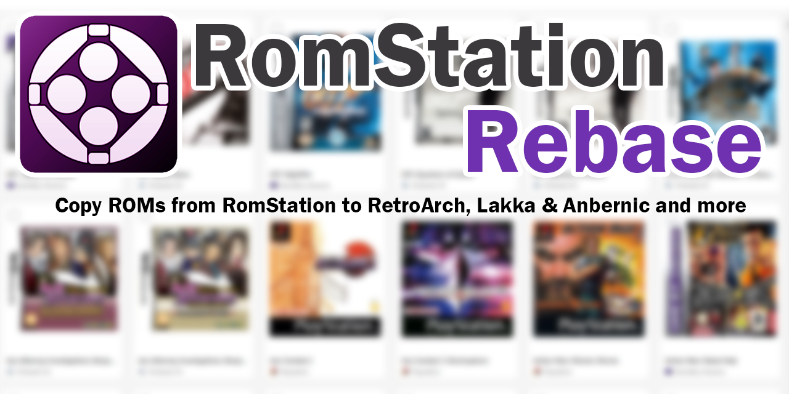

# RomStation Rebase

**[English](README.md) · [Français](README.fr.md)**

Outil Windows pour copier vos ROMs depuis RomStation vers des structures conventionnées compatibles RetroArch, Lakka et les appareils portables Anbernic.

---

## Pourquoi cet outil ?

[RomStation](https://www.romstation.fr/) centralise votre bibliothèque d'émulateurs et de ROMs rétro dans une interface unique. Mais lorsqu'on souhaite utiliser ses ROMs avec **RetroArch**, sur une **console portable Anbernic**, ou tout autre frontend, on se retrouve face à un problème : ces supports attendent une **arborescence conventionnée** (`/roms/psx`, `/roms/snes`, `/roms/gba`, etc.) très différente de celle de RomStation.

**RomStation Rebase** automatise cette copie en respectant les conventions attendues par chaque support, et ce, sans jamais modifier votre installation RomStation.

> ⚠️ RomStation Rebase travaille **toujours en copie**. Votre installation RomStation reste intacte et pleinement fonctionnelle.

---

## Installation

Deux versions sont disponibles sur la page des [Releases](https://github.com/Letalys/RomStationRebase/releases) — choisissez celle que vous préférez :

- **Installeur MSI** (recommandé) : installation Windows classique avec raccourci dans le menu Démarrer et désinstalleur
- **Version portable ZIP** : à extraire n'importe où et à lancer via `RomStationRebase.exe`, sans installation

La version la plus récente est toujours disponible sur la page de la [dernière release](https://github.com/Letalys/RomStationRebase/releases/latest).

---

## Prérequis

- **Windows 10 ou 11** (64-bit)
- **RomStation** installé (version setup.exe **ou** ZIP portable — les deux sont supportées)
- RomStation doit avoir été lancé **au moins une fois** pour que sa base de données soit initialisée

L'application embarque le runtime **.NET 10** — aucune installation supplémentaire n'est nécessaire.

---

## Utilisation

1. **Lancez RomStation Rebase**
2. **Sélectionnez** les jeux que vous souhaitez copier (case à cocher, ou "Tout sélectionner" par système)
3. Cliquez sur **Rebase vers...**
4. **Choisissez** le dossier de destination (carte SD, clé USB, disque externe...)
5. **Sélectionnez l'architecture cible** : RetroArch / Lakka / ArkOS / ...
6. Cliquez sur **Démarrer**

Les ROMs sont copiées dans la structure de dossiers attendue par votre support cible.

---

## Fonctionnalités principales

- **Deux modes d'affichage** : mosaïque (jaquettes) ou liste détaillée
- **Filtrage par système** : n'affichez que les plateformes qui vous intéressent
- **Détection intelligente de RomStation** : automatique via le registre Windows, ou sélection manuelle si RomStation est installé en version ZIP portable
- **Copie parallélisée** : plusieurs fichiers copiés simultanément, vitesse optimisée
- **Gestion des doublons** : politique au choix (ignorer ou écraser)
- **Réessais automatiques** en cas d'échec transitoire (disque réseau, clé USB instable...)
- **Mémorisation des préférences** : le dernier dossier de destination, l'architecture cible et les réglages sont restaurés à chaque lancement
- **Interface localisée** : français et anglais (détection automatique selon la langue du système)
- **Rapport d'exécution** : suivi en temps réel avec statut par jeu (terminé, ignoré, échoué) et export du journal

---

## Architecture technique

- **C# / WPF** — interface Windows native avec pattern MVVM
- **.NET 10** — self-contained, aucune dépendance externe à installer
- **IKVM** — pont Java ↔ .NET pour accéder à la base de données **Apache Derby** de RomStation
- **Apache Derby** — lecture sur une copie locale de la base

La base de données RomStation est toujours travaillée **sur une copie**. L'original reste intact.

---

## Changelog

L'historique complet des versions est disponible dans [CHANGELOG.md](CHANGELOG.md).

---

## Licence

Distribué sous licence **MIT**. Voir le fichier [LICENSE](LICENSE) pour plus de détails.

---

© 2026 [Letalys](https://github.com/Letalys)