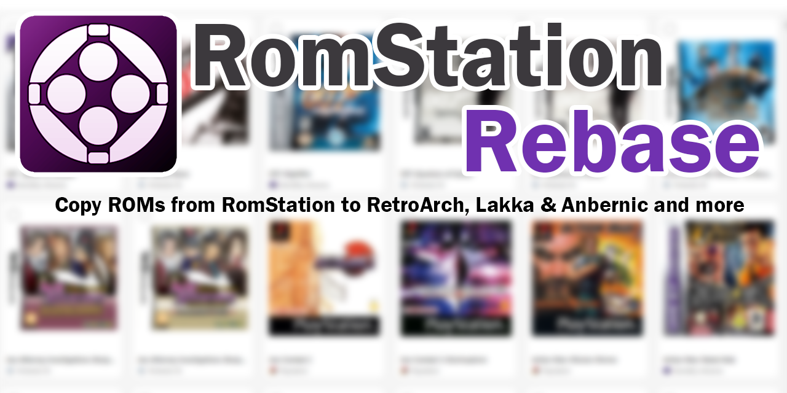

# RomStation Rebase

**[English](README.md) · [Français](README.fr.md)**

Outil Windows qui copie vos jeux depuis RomStation vers une carte SD ou un dossier, rangés et nommés comme l'attend votre console portable ou votre frontend : ArkOS et dArkOS, RetroArch, Batocera, EmulationStation, ES-DE, Onion, Cocoon, firmware Anbernic d'origine.

---

## Pourquoi cet outil ?

[RomStation](https://www.romstation.fr/) réunit émulateurs et jeux rétro dans une seule interface, et range ses fichiers à sa manière. Une console Anbernic, **RetroArch** ou **EmulationStation** attendent autre chose : un dossier par système (`psx`, `snes`, `gba`…), des noms de fichiers lisibles, des jeux parfois extraits de leur archive, des jaquettes et un fichier de métadonnées au bon endroit.

**RomStation Rebase** fait ce travail pour les jeux que vous cochez, selon la cible que vous choisissez.

> ⚠️ RomStation Rebase travaille **toujours en copie**. Votre installation RomStation n'est jamais modifiée.

> ℹ️ Seuls les jeux, leurs jaquettes et leurs métadonnées sont copiés. **Les sauvegardes faites dans RomStation ne sont pas transférées**, et ni BIOS ni émulateur ne sont copiés. Voir la page [Limites](https://github.com/Letalys/RomStationRebase/wiki/Limites) du wiki.

---

## Installation

Deux versions sont proposées sur la page des [Releases](https://github.com/Letalys/RomStationRebase/releases/latest) :

- **Installeur MSI** (recommandé) : installation Windows classique, avec raccourci et désinstalleur
- **Version portable ZIP** : à extraire où vous voulez, puis lancer `RomStationRebase.exe`

### Prérequis

- **Windows 10 ou 11** (64 bits)
- **RomStation** installé, par son programme d'installation ou en version ZIP portable, avec des jeux téléchargés
- RomStation lancé **au moins une fois**, pour que sa base de données existe
- Environ **350 Mo** d'espace disque pour l'application, et une destination (carte SD, clé USB, dossier) avec la place des jeux choisis
- Facultatif, pour les conversions : **chdman**, **DolphinTool** ou **maxcso**. Les deux premiers sont déjà dans les émulateurs que RomStation installe

Le runtime **.NET 10** est fourni avec l'application : ni .NET ni Java à installer. Le détail est dans la page [Prérequis](https://github.com/Letalys/RomStationRebase/wiki/Prérequis) du wiki.

---

## Utilisation

1. **Cochez** les jeux à copier dans la bibliothèque
2. Cliquez sur **Rebase vers…**
3. Choisissez la **destination** (carte SD, clé USB, dossier) et l'**architecture cible préconfigurée** qui correspond à votre appareil
4. Cliquez sur **Démarrer**

Le tableau de la fenêtre de rebase annonce, jeu par jeu, ce qui sera écrit avant que rien ne soit copié. La documentation complète est dans le [wiki](https://github.com/Letalys/RomStationRebase/wiki), en français et en anglais.

---

## Fonctionnalités

### Des fichiers prêts pour la cible

- **Huit architectures cibles préconfigurées** : ArkOS / dArkOS, RetroArch / Lakka, Batocera / Knulli, EmulationStation / RetroPie, ES-DE, Cocoon, Onion / Miyoo Mini, firmware Anbernic d'origine. Chacune connaît ses noms de dossiers et ses règles par système
- **Nommage fiable** : les romsets arcade gardent leur nom d'origine, les disques d'un même jeu sont numérotés et réunis dans une playlist **M3U**, les jeux au même titre ne s'écrasent plus
- **Extraction des archives** pour les systèmes dont l'émulateur ne lit pas le zip (PSP, Playstation, GameCube, Saturn, Dreamcast…)
- **Jaquettes** copiées à l'endroit où la cible les cherche, redimensionnées si elle l'impose
- **Métadonnées** dans le fichier que lit la cible (`gamelist.xml` EmulationStation ou ES-DE, `miyoogamelist.xml`, `metadata.pegasus.txt`, `.dat` Logiqx), en français ou en anglais. Un fichier existant est fusionné : favoris et compteurs de parties sont conservés
- **Une seule entrée par jeu dans EmulationStation**, même pour un jeu à plusieurs disques (ArkOS / dArkOS)
- **Conversion par outil externe** pendant la copie : GDI ou CUE/BIN vers CHD avec chdman, ISO vers CSO, GameCube et Wii vers RVZ avec DolphinTool. Les émulateurs installés par RomStation contiennent déjà chdman et DolphinTool, RomStation Rebase propose leur emplacement

### Pour travailler confortablement

- **Éditeur d'architectures** : adaptez une architecture ou créez la vôtre sans toucher à un fichier JSON
- **Règles par jeu** : romset, M3U, extraction et conversion se règlent aussi ligne par ligne, pour le rebase en cours
- **Présélections** (fichiers `.rsrgp`) : les jeux cochés et tous les paramètres du rebase dans un fichier, à rouvrir d'un double-clic
- **Journal détaillé** de chaque rebase, à suivre en direct dans sa propre fenêtre
- **Deux modes d'affichage**, filtres par système, recherche, abécédaire, fiche détaillée de chaque jeu
- **Copie parallélisée**, nouvelles tentatives en cas d'échec, doublons ignorés ou écrasés, pause et annulation
- **Thème clair ou sombre**, interface en français et en anglais
- **Vérification des mises à jour** au démarrage

---

## Architecture technique

- **C# / WPF**, pattern MVVM
- **.NET 10**, application autonome sans dépendance à installer
- **IKVM**, pont Java vers .NET pour lire la base **Apache Derby** de RomStation
- La base de données RomStation est toujours lue **sur une copie**, l'original reste intact
- Projet de tests **xUnit** pour les règles de nommage, les formats de sortie et le pilotage des outils externes

---

## Développement et tests

- La version **1.3.0** a été co-écrite avec une IA : [Claude Code](https://claude.com/claude-code), modèle Claude Fable 5.1 d'Anthropic. Letalys a défini les besoins, arbitré chaque choix et validé le résultat
- Les tests sur console ont été faits sur une **Anbernic RG353V sous dArkOS**. Les autres architectures cibles suivent la documentation de chaque système : un [retour sur votre appareil](https://github.com/Letalys/RomStationRebase/issues/new/choose) est bienvenu
- Chaque message d'erreur porte un [code](https://github.com/Letalys/RomStationRebase/wiki/Codes-erreur) `RSR-nnnn`, à citer dans une issue

---

## Changelog

L'historique des versions est dans [CHANGELOG.fr.md](CHANGELOG.fr.md).

---

## Licence

Distribué sous licence **MIT**. Voir le fichier [LICENSE](LICENSE).

---

© 2026 [Letalys](https://github.com/Letalys)
